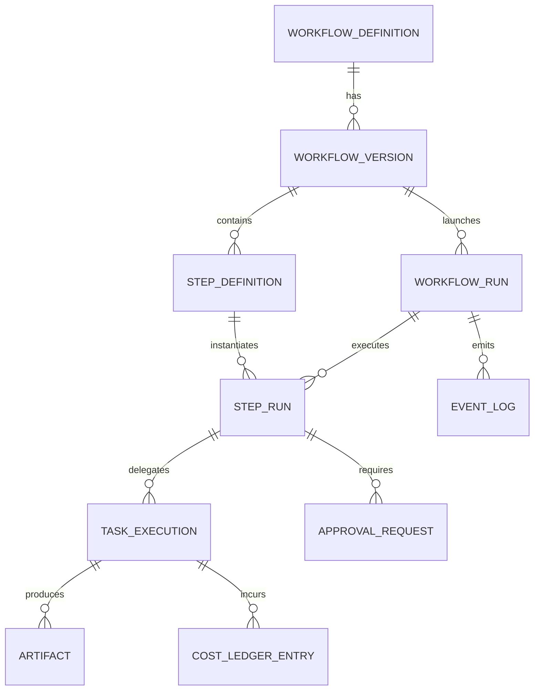

# ERD

This section documents the recommended persistence model for a durable orchestration platform and how it maps to workflow execution concerns.

## Purpose

The ERD separates immutable workflow definition state from mutable run state, while preserving audit history for retries, approvals, and events.

## Core entities

- `WORKFLOW_DEFINITION`: stable workflow namespace
- `WORKFLOW_VERSION`: immutable, published snapshot of the definition
- `STEP_DEFINITION`: step metadata per workflow version
- `WORKFLOW_RUN`: one execution instance of a workflow version
- `STEP_RUN`: step materialization for a specific run
- `TASK_EXECUTION`: one concrete task attempt for a step run
- `APPROVAL_REQUEST`: human/policy gate records
- `ARTIFACT`: produced files, patches, logs, snapshots
- `EVENT_LOG`: append-only run and step transitions
- `COST_LEDGER_ENTRY`: usage and cost records per task execution

## ER diagram

## Design rules

- published workflow versions are immutable
- retries create a new `TASK_EXECUTION` attempt on the same `STEP_RUN`
- event ordering is monotonic per run (`sequence_number`)
- large logs/artifacts can live in object storage, with relational metadata in DB
- approval history is explicit and queryable, not inferred from free-form comments

## Mapping to current CLI

The current `workflow-manager` implementation is in-memory and does not persist these tables yet. It already models the same conceptual boundaries via `WorkflowDefinition`, `StepRun`, run statuses, and `RunEvent`, which keeps migration to durable persistence straightforward.
