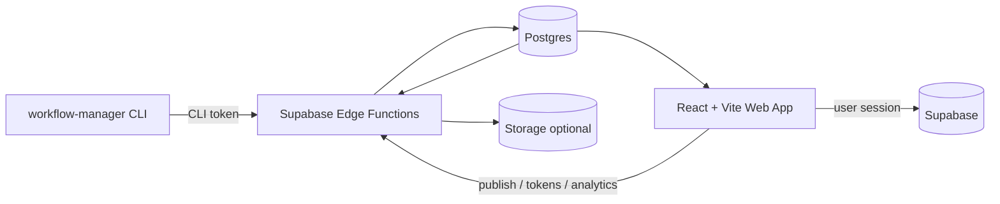
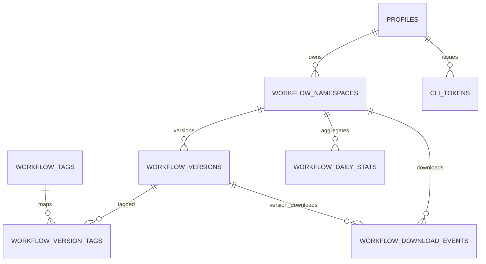

# Remote Workflow Registry Architecture

Status: proposed

Owner: workflow-manager core team

Last updated: 2026-04-19

## Purpose

This document defines the architecture for a remote workflow registry service that extends `workflow-manager` beyond local execution.

The registry is not a separate repository. It is planned as an additional app inside the existing `workflow-manager` repo.

The new system allows users to:

- create an account in a web app
- publish workflows from the CLI with metadata
- discover and download workflows created by other users
- track analytics such as downloads, publish date, and version history
- create CLI tokens from the web UI and use them locally for authenticated push/pull operations

The current local workflow engine remains the execution core. The remote service is a distribution, identity, and analytics layer.

## Scope

V1 includes:

- user accounts and profiles
- a React + Vite web app
- Supabase-backed registry storage and auth
- CLI token issuance and revocation
- CLI `publish`, `pull`, `search`, and `auth` flows
- public workflow discovery
- private owner-managed workflows and drafts
- analytics for downloads and versions

Out of scope for V1:

- team workspaces and org billing
- cloud execution of workflows
- collaborative workflow editing
- comments, ratings, or marketplace payments

## Design Principles

- Keep local execution independent from the registry.
- Preserve existing `WorkflowDefinition` and `runWorkflow(...)` contracts.
- Store raw workflow source in addition to normalized parsed JSON.
- Use Supabase RLS for user-owned data and Edge Functions for privileged actions.
- Keep secrets server-side; do not expose service-role credentials to browsers or the CLI.
- Make real remote operations opt-in and explicit in the CLI.

## Current Codebase Alignment

The current repository already has clean seams for this expansion.

- `src/index.ts` is the command boundary for new CLI commands.
- `src/parser.ts` is the normalization seam for Markdown and JSON workflows.
- `src/engine.ts` should remain registry-agnostic.
- `src/types.ts` already defines the workflow and run contracts the remote service should preserve.

Important caveat:

- Markdown notes outside frontmatter are currently discarded during parse normalization.
- Because of that, the registry must store raw source text, not only normalized JSON.

## Technology Choices

### Web App

- React
- Vite
- React Router
- TanStack Query
- Supabase JS client

This app should live under `apps/remote-registry/` inside the main repository.

### Backend Platform

- Supabase Auth
- Supabase Postgres
- Supabase Edge Functions
- Supabase Storage only if workflow attachments/assets are introduced later

### CLI Integration

- Keep the existing Bun + TypeScript CLI
- Add remote commands under a new `src/remote/` area
- Use personal CLI tokens for non-browser authentication

## Validation Notes

The architecture direction is validated against the current repository boundaries and external platform guidance:

- Supabase auth and session patterns support a shared client plus auth state subscriptions in the web app.
- Supabase RLS is appropriate for user-owned rows and controlled visibility.
- Supabase Edge Functions are the correct place for privileged actions, token handling, and analytics writes.
- Vite only exposes `VITE_*` variables to the browser, so secrets must remain server-side.
- React + Vite is a valid SPA choice here because this project needs a dashboard and search UI, not SSR-first content.

### Context7 validation

Framework choices were re-checked with Context7 before implementation planning.

- Supabase (`/supabase/supabase`): browser clients should use publishable/anon credentials with RLS enabled; Edge Functions should create a client with the caller's `Authorization` header when user-scoped RLS must be enforced; service-role credentials stay server-side.
- React (`/reactjs/react.dev`): the dashboard should use route-based sections with a top-level auth/session provider and server-state fetched per screen rather than mixing auth and page logic across many leaf components.
- Vite (`/vitejs/vite`): only `VITE_*` variables are exposed to the client bundle; do not expose secrets through `envPrefix`; keep Supabase publishable keys in client env and everything privileged in Edge Functions.

## High-Level System



## Top-Level Components

### 1. CLI Client

Responsibilities:

- authenticate via CLI token
- validate workflows locally before publish
- publish workflow files and metadata
- search remote workflows
- pull workflows to local files
- preserve compatibility with `validate` and `run`

Planned commands:

- `wfm auth login --token <token>`
- `wfm auth whoami`
- `wfm auth logout`
- `wfm publish <file>`
- `wfm pull <owner/slug>`
- `wfm search <query>`
- `wfm remote info <owner/slug>`

### 2. Web App

Responsibilities:

- account creation and sign-in
- dashboard for created workflows
- metadata editing and publish flows
- CLI token management
- public search and workflow detail pages
- analytics views for creators

Key routes:

- `/`
- `/search`
- `/workflow/:owner/:slug`
- `/auth/sign-in`
- `/auth/sign-up`
- `/dashboard`
- `/dashboard/workflows/:slug`
- `/dashboard/tokens`

### 3. Supabase Auth

Responsibilities:

- user identity
- email/password auth for V1
- session lifecycle for the web app

Notes:

- browser clients use the publishable key only
- web app uses Supabase session state
- CLI does not reuse browser session directly

### 4. Postgres Registry

Responsibilities:

- store workflow namespaces and immutable versions
- store raw source and normalized definitions
- store profiles, tokens, tags, and analytics
- enforce ownership and visibility through RLS

### 5. Edge Functions

Responsibilities:

- issue and revoke CLI tokens
- validate and publish workflows server-side
- return workflow artifacts for pull
- record analytics events
- handle privileged logic that should not live in the browser

## Auth And Token Model

### Web Authentication

- Standard Supabase Auth session
- session restored on app boot with `getSession()`
- UI reacts to `onAuthStateChange(...)`

### CLI Authentication

- user signs into the web UI
- user creates a CLI token in the dashboard
- token is shown once and stored hashed in the database
- CLI stores the token locally and sends it as a bearer token to Edge Functions

Why use CLI tokens instead of browser sessions:

- clearer operational model for terminal users
- explicit revocation and scoped usage
- easier rate limiting and audit trails
- better separation between browser and terminal auth flows

## Publish And Pull Flows

### Publish Flow

1. CLI resolves the local file path.
2. CLI parses with `parseWorkflowFile(...)`.
3. CLI validates with `validateWorkflow(...)`.
4. CLI uploads metadata, raw source, format, and normalized definition.
5. Edge Function re-validates payload.
6. Server creates or updates the workflow namespace and inserts an immutable version.
7. Server returns the canonical slug, version, and web URL.

### Pull Flow

1. CLI requests a workflow by slug and optional version.
2. Edge Function authorizes access based on visibility.
3. Server returns raw source in the original format.
4. CLI writes the file locally.
5. CLI optionally validates after write.
6. Server records a download event.

## Search Model

Search should operate on registry metadata, not execution state.

Indexed fields:

- title
- description
- tags
- owner username
- visibility
- adapter usage
- publish date

Ranking inputs:

- text relevance
- recent downloads
- recent publish date
- exact slug matches

## Data Model

### Core Tables

- `profiles`
- `workflow_namespaces`
- `workflow_versions`
- `workflow_tags`
- `workflow_version_tags`
- `cli_tokens`
- `workflow_download_events`
- `workflow_daily_stats`

### Entity Meanings

- `workflow_namespaces`: stable identity for a shared workflow
- `workflow_versions`: immutable published revisions
- `cli_tokens`: hashed user-issued CLI credentials
- `workflow_download_events`: append-only analytics source table
- `workflow_daily_stats`: aggregate analytics for dashboards

## Suggested ERD Additions



## RLS Strategy

- `profiles`: public read, self update
- `workflow_namespaces`: public read only when public; owner full access
- `workflow_versions`: public read only for public published versions; owner access for private/draft content
- `cli_tokens`: owner metadata only; raw token is never stored
- `workflow_download_events`: no direct client writes
- analytics aggregation writes only from trusted function/server paths

## Edge Function Surface

Planned functions:

- `create-cli-token`
- `revoke-cli-token`
- `publish-workflow`
- `pull-workflow`
- `search-workflows`
- `workflow-analytics`

Guidelines:

- use caller identity where user-scoped behavior is required
- use service-role only inside function internals
- do not expose privileged keys to clients
- return normalized, versioned DTOs

## Web UI Architecture

### Public Area

- marketing page
- public search
- workflow detail pages with copyable CLI commands

### Authenticated Dashboard

- created workflows list
- versions and visibility controls
- publish/edit metadata forms
- analytics charts and summaries
- token creation and revocation

### State Boundaries

- use React Router for route segmentation
- use TanStack Query for server-state and caching
- keep auth session in a top-level provider
- keep form state local to pages/components

## Environment And Secret Boundaries

Browser-safe env vars:

- `VITE_SUPABASE_URL`
- `VITE_SUPABASE_PUBLISHABLE_KEY`
- public site metadata

Server-only secrets:

- Supabase service-role key
- token hashing secret if used separately
- analytics or admin integration secrets

## Repo Structure Proposal

```text
workflow-manager/
  apps/
    remote-registry/
  doc/
    remote-registry/
      index.md
      tasks.md
  src/
    remote/
      api.ts
      auth.ts
      config.ts
      commands/
  supabase/
    migrations/
    functions/
    seed.sql
```

## CLI Extension Strategy

- Keep parser and engine unchanged where possible.
- Add a remote client layer instead of coupling registry logic to execution.
- Publish should reuse existing local validation.
- Pull should materialize a local file and then rely on existing local commands.
- Keep the CLI, remote-registry app, and Supabase config in the same repository and version together.

## Analytics Model

Track:

- total downloads
- downloads per version
- downloads over time
- created at
- updated at
- last downloaded at

Implementation guidance:

- record append-only download events
- aggregate into daily stats with scheduled jobs or function-based upserts
- expose creator dashboards through owner-only queries

## Risks

- losing Markdown notes if raw source is not stored
- overusing direct browser DB access for actions that should be privileged
- unclear separation between CLI tokens and web sessions
- analytics inconsistencies if download logging is not centralized
- scope creep into cloud execution before the registry is solid

## Delivery Phases

### Phase 0: Architecture And Contracts

- finalize schema and API DTOs
- define auth model and token scopes
- document CLI command contracts

### Phase 1: Supabase Foundation

- create project
- add migrations and RLS
- seed minimal data

### Phase 2: Backend APIs

- implement token, publish, pull, search, analytics functions

### Phase 3: CLI Integration

- implement auth, publish, pull, search commands
- add config/token persistence

### Phase 4: Web App

- implement auth, search, detail pages, dashboard, tokens, analytics

### Phase 5: Hardening

- rate limiting
- observability
- previews and release docs

## Workstreams

- Workstream A: Supabase schema, migrations, and RLS
- Workstream B: Edge Functions and server DTOs
- Workstream C: CLI remote commands and config handling
- Workstream D: React + Vite web app and dashboard UX
- Workstream E: analytics, observability, and operational tooling
- Workstream F: testing, release, and deployment automation

## Delivery Agents

The initial agent team for implementation lives in `.opencode/agent/`.

- Orchestrator: `.opencode/agent/remote-registry-orchestrator.md`
- Supabase platform: `.opencode/agent/supabase-platform-engineer.md`
- Edge Functions: `.opencode/agent/edge-functions-engineer.md`
- CLI integration: `.opencode/agent/cli-registry-engineer.md`
- Web app: `.opencode/agent/remote-registry-ui-engineer.md`
- Analytics and ops: `.opencode/agent/analytics-ops-engineer.md`
- QA and release: `.opencode/agent/qa-release-engineer.md`

## Success Criteria

- a user can sign up on the web and create a CLI token
- a user can publish a Markdown or JSON workflow from the CLI
- another user can search and pull a public workflow
- a pulled workflow runs locally with the current engine
- the creator can see version history and download analytics in the web dashboard
- the system enforces visibility and ownership using RLS and trusted server paths

## Related Document

- Detailed milestones and task breakdown: `doc/remote-registry/tasks.md`
- Agent team and workstream ownership: `doc/remote-registry/agents.md`
