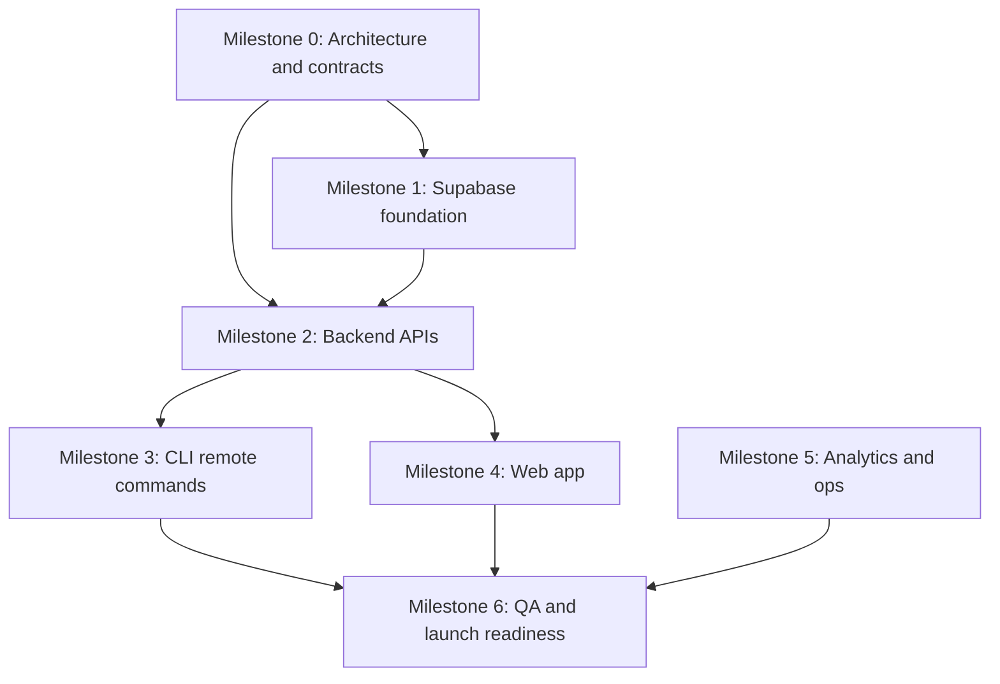

# Remote Registry Tasks And Milestones

Status: proposed

This document breaks the remote workflow registry project into milestones, tasks, dependencies, and workstreams.

Definitions:

- Milestone: a related set of tasks that produces a meaningful delivery outcome
- Task: a concrete implementation item that can be assigned and verified
- Workstream: a group of tasks that can proceed in parallel with limited blocking dependencies

## Delivery Overview

## Workstreams

### Workstream A: Platform Data Foundation

Focus:

- schema design
- migrations
- RLS
- seed data

### Workstream B: Backend Service Layer

Focus:

- Edge Functions
- server DTOs
- token issuance
- publish/pull/search endpoints

### Workstream C: CLI Remote Integration

Focus:

- new CLI commands
- token storage
- registry client
- publish/pull/search flows

### Workstream D: Web Product Experience

Focus:

- React + Vite app
- auth flows
- dashboard
- workflow detail pages
- token management UI

### Workstream E: Analytics And Operations

Focus:

- download tracking
- aggregation jobs
- dashboards
- rate limiting
- monitoring

### Workstream F: QA, Release, And Enablement

Focus:

- tests
- preview environments
- docs
- onboarding
- release readiness

## Milestone 0: Architecture And Contracts

Outcome:

- shared design baseline is approved
- implementation contracts are frozen enough to unblock parallel work

Tasks:

### Task M0.1 - Finalize architecture document

- Workstream: cross-cutting
- Deliverable: `doc/remote-registry/index.md`
- Verify: architecture review sign-off

### Task M0.2 - Define API DTOs

- Workstream: B
- Define request/response shapes for:
  - publish workflow
  - pull workflow
  - search workflows
  - create token
  - revoke token
  - analytics summary
- Verify: DTO review with CLI and web teams

### Task M0.3 - Define visibility and versioning rules

- Workstream: A
- Decide V1 semantics for:
  - public vs private
  - draft vs published
  - immutable version records
  - slug ownership and uniqueness
- Verify: decision note included in schema design

### Task M0.4 - Define CLI auth model

- Workstream: B / C
- Document token scopes and local storage behavior
- Verify: auth flow sequence diagram approved

## Milestone 1: Supabase Foundation

Outcome:

- a working Supabase project exists locally and in a shared dev environment
- schema and policies support user-owned workflows

Tasks:

### Task M1.1 - Initialize Supabase project structure

- Workstream: A
- Add `supabase/` directory with config and baseline migrations
- Verify: local Supabase stack boots successfully

### Task M1.2 - Create profiles table

- Workstream: A
- Columns:
  - `id`
  - `username`
  - `display_name`
  - `avatar_url`
  - timestamps
- Verify: profile record can be created for a signed-in user

### Task M1.3 - Create workflow namespace table

- Workstream: A
- Columns:
  - `id`
  - `owner_user_id`
  - `slug`
  - `title`
  - `description`
  - `visibility`
  - `latest_version_id`
  - timestamps
- Verify: unique owner/slug rules enforced

### Task M1.4 - Create workflow version table

- Workstream: A
- Columns:
  - `id`
  - `namespace_id`
  - `version_label`
  - `source_format`
  - `raw_source`
  - `definition_json`
  - `changelog`
  - `published_state`
  - timestamps
- Verify: versions are immutable after publish

### Task M1.5 - Create tags and join tables

- Workstream: A
- Verify: workflow versions can be queried by tag

### Task M1.6 - Create CLI token table

- Workstream: A
- Store token metadata and hash only
- Verify: raw token is never persisted

### Task M1.7 - Create analytics tables

- Workstream: A / E
- Add:
  - `workflow_download_events`
  - `workflow_daily_stats`
- Verify: download event insert path is supported

### Task M1.8 - Write RLS policies

- Workstream: A
- Policies for profiles, namespaces, versions, and token metadata
- Verify: owner-only mutation behavior and public-read rules

### Task M1.9 - Seed data and local dev bootstrap

- Workstream: A / F
- Verify: local developers can start with one command sequence

## Milestone 2: Backend APIs

Outcome:

- trusted server APIs exist for token management and registry operations

Tasks:

### Task M2.1 - Implement `create-cli-token`

- Workstream: B
- Requirements:
  - authenticated web session
  - generate secret once
  - store hash and metadata
  - return plain token once
- Verify: token can be used immediately by CLI

### Task M2.2 - Implement `revoke-cli-token`

- Workstream: B
- Verify: revoked token fails subsequent requests

### Task M2.3 - Implement `publish-workflow`

- Workstream: B
- Requirements:
  - accept raw source and normalized definition
  - re-validate server-side
  - create namespace or append version
  - normalize tags and metadata
- Verify: publish succeeds for valid Markdown and JSON workflows

### Task M2.4 - Implement `pull-workflow`

- Workstream: B
- Requirements:
  - support latest or explicit version
  - enforce visibility
  - return raw source and metadata
  - record download event
- Verify: unauthorized access is denied for private workflows

### Task M2.5 - Implement `search-workflows`

- Workstream: B
- Requirements:
  - public discovery
  - filters for tag, owner, adapter, visibility
  - sort by relevance and recency
- Verify: search endpoint returns stable summaries

### Task M2.6 - Implement `workflow-analytics`

- Workstream: B / E
- Requirements:
  - owner-only access
  - downloads by day and by version
- Verify: dashboard can query analytics without direct raw table access

### Task M2.7 - Add backend integration tests

- Workstream: F
- Verify publish, pull, token, and analytics flows against local Supabase

## Milestone 3: CLI Remote Commands

Outcome:

- the existing CLI can authenticate, publish, search, and pull workflows

Tasks:

### Task M3.1 - Add remote config layer

- Workstream: C
- Add files for local config resolution and persistence
- Verify: token and endpoint config load reliably across OSes

### Task M3.2 - Add `auth login`

- Workstream: C
- Requirements:
  - accept token input
  - optionally support env var fallback
  - save token locally
- Verify: CLI can authenticate after login

### Task M3.3 - Add `auth whoami`

- Workstream: C
- Verify: current authenticated profile is displayed

### Task M3.4 - Add `auth logout`

- Workstream: C
- Verify: local token/config is removed cleanly

### Task M3.5 - Add `publish`

- Workstream: C
- Requirements:
  - reuse `parseWorkflowFile(...)`
  - reuse `validateWorkflow(...)`
  - upload raw source and metadata
- Verify: Markdown and JSON publish paths both work

### Task M3.6 - Add `pull`

- Workstream: C
- Requirements:
  - fetch by slug/version
  - write local file in original format by default
  - support explicit output path
- Verify: pulled file can immediately pass local `validate`

### Task M3.7 - Add `search`

- Workstream: C
- Verify: search results are concise and copyable into `pull`

### Task M3.8 - Add CLI end-to-end tests

- Workstream: F
- Verify authenticated publish and pull round-trips against local Supabase

## Milestone 4: Web App

Outcome:

- users can manage workflows and tokens in a browser

Tasks:

### Task M4.1 - Scaffold React + Vite app

- Workstream: D
- Add app shell, routing, env typing, and Supabase client bootstrap
- Verify: app boots locally and reads `VITE_*` config safely

### Task M4.2 - Implement auth screens

- Workstream: D
- Add sign-in, sign-up, sign-out, and session restore flows
- Verify: protected dashboard routes require auth

### Task M4.3 - Implement public search page

- Workstream: D
- Verify: public workflows are searchable and filterable

### Task M4.4 - Implement workflow detail page

- Workstream: D
- Show description, versions, tags, analytics summary, and copyable CLI commands
- Verify: page is shareable and readable without auth for public workflows

### Task M4.5 - Implement dashboard home

- Workstream: D
- Show created workflows, recent versions, and quick stats
- Verify: owner sees only own data

### Task M4.6 - Implement token management UI

- Workstream: D
- Support token creation, reveal-once, and revocation
- Verify: token creation path works end-to-end with CLI login

### Task M4.7 - Implement publish/manage workflow UI

- Workstream: D
- Requirements:
  - create metadata
  - list versions
  - toggle visibility
- Verify: metadata changes reflect in public detail pages

## Milestone 5: Analytics And Operations

Outcome:

- the service has usable creator analytics and operational controls

Tasks:

### Task M5.1 - Centralize download event logging

- Workstream: E
- Verify: all pull operations create analytics events

### Task M5.2 - Implement aggregation job

- Workstream: E
- Aggregate daily download stats
- Verify: dashboard reads from summary tables efficiently

### Task M5.3 - Add dashboard analytics views

- Workstream: D / E
- Show totals, trends, and per-version download counts
- Verify: creator can identify top workflows and recent usage

### Task M5.4 - Add rate limiting and abuse protection

- Workstream: E
- Cover token creation, publish, and pull endpoints
- Verify: repeated abuse attempts are throttled

### Task M5.5 - Add monitoring and error logging

- Workstream: E
- Verify: failed backend operations are visible to maintainers

## Milestone 6: QA And Launch Readiness

Outcome:

- the platform is documented, testable, and ready for shared developer use

Tasks:

### Task M6.1 - Add local developer onboarding doc

- Workstream: F
- Include Supabase local startup, web app startup, and CLI config steps
- Verify: a new developer can get to first publish locally

### Task M6.2 - Add integration test matrix

- Workstream: F
- Cover:
  - Markdown publish
  - JSON publish
  - auth login/logout
  - public pull
  - private pull denial
  - analytics increments
- Verify: CI passes against the supported matrix

### Task M6.3 - Add preview deployment plan

- Workstream: F
- Verify: web app and Supabase dev environment can be exercised before production changes

### Task M6.4 - Add release checklist

- Workstream: F
- Include DB migration review, env review, auth config, rollback notes
- Verify: checklist can be used for first release rehearsal

## Parallelization Map

These milestones can overlap once Milestone 0 is sufficiently stable:

- Workstream A can start schema work immediately after contract review
- Workstream B can start Edge Function stubs once schema names are frozen
- Workstream C can build CLI config and command scaffolding in parallel with backend implementation
- Workstream D can scaffold the web app and auth shell in parallel with backend work
- Workstream E can define analytics event models in parallel with schema work
- Workstream F can begin local dev docs and test harness setup early

## Critical Path

The main blocking chain is:

1. architecture and DTO decisions
2. schema and RLS
3. publish/pull/token backend APIs
4. CLI remote commands
5. end-to-end integration tests

The web app can parallelize heavily, but token creation and analytics views depend on backend availability.

## First Slice Recommendation

Build the thinnest end-to-end slice first:

1. profiles + workflow namespace/version tables
2. token issuance function
3. publish function
4. pull function
5. CLI `auth login`
6. CLI `publish`
7. CLI `pull`
8. minimal dashboard page to create a token

This slice validates the most important product promise with the least surface area.

## Definition Of Done

The project is ready for wider internal use when:

- local Supabase dev works reliably
- CLI publish/pull is functional with real auth
- public workflows are searchable from the web
- private workflows are protected by policy
- analytics are visible in the creator dashboard
- docs cover setup, usage, and troubleshooting
